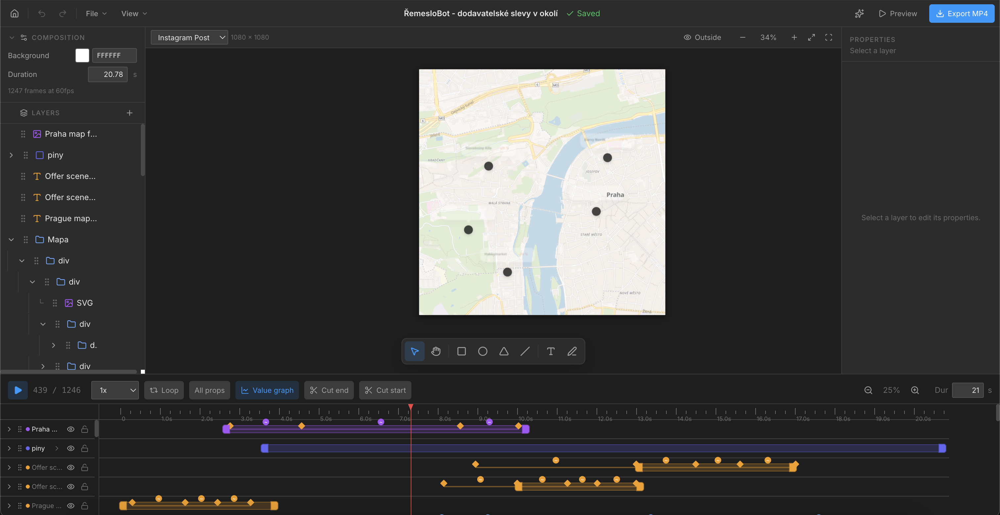

# Tech Explainer Studio

Tech Explainer Studio is a local-first visual editor for creating editable technical education videos, especially software-engineering and system-design explainers. It is built from the MotionEditor foundation and runs as a React/Vite app with a small local Node/Vite middleware backend for JSON storage, asset storage, library storage, AI actions, and Remotion exports.

The goal is to keep authoring direct: create or import a project, add editable layers, manipulate them on the canvas, animate them on the timeline, reuse saved components and animation snippets, and export a video without setting up a hosted backend. The product is manual-first and AI-assisted; it is not a prompt-to-video black box or a general-purpose social-video editor.

## Preview



<video src="docs/videos/remeslobot-voice-demo.mp4" controls muted loop playsinline width="100%"></video>

[Open the video demo](docs/videos/remeslobot-voice-demo.mp4)

## What It Can Do

- Manage multiple projects from a home screen with search, sorting, grid/list views, thumbnails, drag/shift multi-selection, import, export, duplicate, rename, and delete.
- Create projects with common canvas presets for YouTube, Instagram, TikTok, and custom sizes.
- Edit a canvas with rectangles, ellipses, lines, triangles, custom SVG paths, text, raster images, SVG images, videos, audio, and Lucide icons.
- Import HTML into the reusable library and convert DOM-like structures into editable layer trees with nested layout, text, SVG, fills, strokes, shadows, and common CSS box styles.
- Organize layers with nested groups, drag-and-drop parenting, multi-selection, locking, visibility, layer ordering, and reusable library insertion.
- Animate layers with transform keyframes, per-property animation tracks, multi-selected keyframes across layers, timeline resizing, easing controls, value graph support, and direct keyframe editing.
- Build text animations such as typewriter, character pop, fall, rise, spin, blur, word reveal, and line reveal.
- Build custom motion by entering rotation, skew, scale, opacity, perspective, and other transform/effect values.
- Style layers with fills, gradients, per-side strokes, per-corner radius, SVG stroke/fill controls, image/video fit options, shadows, blur, brightness, contrast, grayscale, and backdrop blur.
- Import and reuse local image, video, and audio assets through the local asset backend.
- Save selected base design elements and reusable animation/keyframe selections into a cross-project library.
- Export MP4/WebM through the local backend with quality presets, frame-range controls, progress, logs, cancel, and reveal/open-location support.
- Use light or dark mode and switch the interface language between English and Czech.
- Auto-save projects and keep manual version history snapshots.
- Store projects, assets, exports, history, and reusable library items as local files ignored by Git.

## Why It Is Easy To Use

MotionEditor is designed around familiar editor concepts:

- The home screen shows every project clearly, with previews.
- The center canvas is for direct manipulation.
- The left panel is for layer structure.
- The bottom timeline is for timing and animation.
- The right panel is for design, style, effects, and motion.
- Most important controls are visual and grouped by intent instead of hidden in menus.

You can start with a blank project, add a shape or text layer, drag it around, open the Motion tab, and create an animation without writing code.

## Tech Stack

- React 19
- Vite 8
- Zustand
- Remotion and Remotion Player
- Tailwind CSS
- Lucide React icons
- i18next and react-i18next
- Local Vite middleware for project, asset, library, AI, and export APIs

## Requirements

- Node.js
- npm

## Run Locally

Install dependencies:

```bash
npm install
```

Start the development server:

```bash
npm run dev
```

Open:

```text
http://localhost:3000
```

The app is local-first. Projects are saved by the dev server into:

```text
data/projects
```

Each project is a JSON file, and version history is stored next to it as a history JSON file. The whole `data/` folder is ignored by Git.

## Build

Create a production build:

```bash
npm run build
```

Preview the production build:

```bash
npm run preview
```

## Exporting Video

The editor exports through the local backend at `/api/exports`. The export modal lets you choose frame range, format, and quality, then starts a Remotion job from the app instead of asking you to run a copied command manually.

Supported formats:

- MP4 using H.264
- WebM using VP9

Quality presets:

- Standard: 1x scale
- High: 2x scale
- Ultra: 3x scale

Export progress is based on the backend job state and Remotion output. It tracks bundling/preparing/rendering/encoding phases, rendered frames, encoded frames, recent logs, cancel status, and the final output path. Finished exports are written to:

```text
data/exports
```

## Optional AI Assistant

The editor includes optional AI help. The top bar AI button opens a full-height ChatKit panel on the right side, so you can keep chatting without covering the canvas. The local AI endpoint is still available for editor actions, graphic generation, and animation prompt experiments.

To enable it, copy the example config:

```bash
cp ai.config.example.json ai.config.local.json
```

Then add your model and API key:

```json
{
  "model": "gpt-4.1-mini",
  "apiKey": "sk-...",
  "chatkitWorkflowId": "wf_..."
}
```

Restart the dev server after changing the config.

`ai.config.local.json` is ignored by Git so the API key is not committed or bundled into the browser. The browser calls the local `/api/chatkit/session` endpoint, and the Vite dev server creates a short-lived ChatKit session token using your OpenAI key and `chatkitWorkflowId`. You can also set `OPENAI_API_KEY`, `OPENAI_MODEL`, and `OPENAI_CHATKIT_WORKFLOW_ID` as environment variables.

AI prompt source files live in:

```text
public/ai-graphic-prompt.md
public/ai-animation-prompt.md
```

The graphic prompt is for generating static editable HTML/SVG designs. The animation prompt is for applying keyframes to existing layers, selected descendants, or selected timeline keyframes.

## Local Backend

The Vite dev server mounts local JSON/file APIs:

- `/api/projects` stores project JSON and history in `data/projects`.
- `/api/assets` stores imported image, video, and audio files in `data/assets`.
- `/api/library` stores reusable design and animation items in `data/library`.
- `/api/exports` starts, tracks, cancels, and reveals Remotion export jobs in `data/exports`.
- `/api/chatkit/session` and `/api/ai-assist` support optional AI workflows.

This is intentionally local-only. There is no database and no hosted service requirement.

## Project Storage

Projects are saved as JSON through local API endpoints implemented in `server/projectStoragePlugin.ts`.

Stored data includes:

- Project name, id, created/updated dates, and thumbnail
- Canvas size, fps, duration, and background
- Full layer tree
- Text styling, shape styling, SVG data, media source references, and imported asset references
- Transform keyframes, per-property keyframes, easing, and custom curves
- Timeline state
- Editor viewport state
- Manual history snapshots

The home screen also supports importing/exporting `.motionproj` files, backing up all projects as JSON, importing HTML into the reusable library, and selecting multiple projects with click, Shift-click, or drag selection.

## Assets And Library

Imported images, videos, and audio are copied into local asset storage and reused from the asset library. Adding an image/video/audio first opens the existing library, with an import-new action at the top.

Reusable library items are separate from raw assets:

- Design items save selected layers at the current frame as base editable styles.
- Animation items save selected layers, frame ranges, and keyframes so they can be reused across projects.
- HTML imports can be saved into the library as editable design elements after previewing and naming them.

## Internationalization

Translations live in:

```text
src/i18n.ts
```

Supported languages:

- English
- Czech

Use the settings button in the app to switch language and theme.

## Useful Scripts

```bash
npm run dev
npm run build
npm run preview
npm run lint
npm test
npx tsc --noEmit
```

## Notes

This is a local editor, not a hosted collaborative platform. It is meant to be simple to run, easy to inspect, and practical for building technical explainer compositions without setting up a database or cloud backend.

For a production deployment, move the project, asset, library, export, and AI endpoints to a real backend so file access, authentication, rate limits, job isolation, and API keys are handled safely.

## Attribution and license

Tech Explainer Studio is derived from [MotionEditor by Tomas Lachmann](https://github.com/tomaslachmann/motion-editor). It is distributed under the [MIT License](LICENSE); see [NOTICE](NOTICE) for the preserved upstream attribution.
